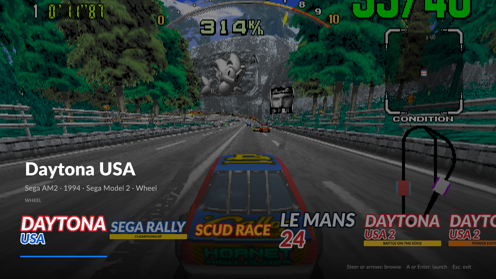

# Slipstream

An arcade launcher for Sega racers and lightgun shooters. Turn it on and
you're looking at a fullscreen carousel of your games — browse with the
wheel or point with the gun, pull the trigger, play. Slipstream downloads
the right emulator (only when you ask), generates video, controls, force
feedback, and gun calibration, and starts the game. Escape — or the Xbox
button on the wheel — quits, every game, every emulator. No config dialogs,
no test-menu archaeology.

Slipstream **never downloads ROMs**. You point it at a directory containing
ROM sets you own.



## Games

Windows · Logitech G923 wheel · Gun4IR lightgun. Thirteen games across two
systems:

| Game | System | Controls | Emulator | ROM set(s) needed |
| --- | --- | --- | --- | --- |
| Daytona USA | Model 2 | Wheel | Model 2 Emulator | `daytona.zip` + `model2.zip` |
| Sega Rally Championship | Model 2 | Wheel | Model 2 Emulator | `srallyc.zip` + `model2.zip` |
| Virtua Cop | Model 2 | Lightgun | Model 2 Emulator | `vcop.zip` + `model2.zip` |
| Virtua Cop 2 | Model 2 | Lightgun | Model 2 Emulator | `vcop2.zip` + `model2.zip` |
| The House of the Dead | Model 2 | Lightgun | Model 2 Emulator | `hotd.zip` + `model2.zip` |
| Gunblade NY | Model 2 | Lightgun | Model 2 Emulator | `gunblade.zip` + `model2.zip` |
| Scud Race | Model 3 | Wheel | Supermodel | `scud.zip` |
| Le Mans 24 | Model 3 | Wheel | Supermodel | `lemans24.zip` |
| Daytona USA 2: Battle on the Edge | Model 3 | Wheel | Supermodel | `daytona2.zip` |
| Daytona USA 2: Power Edition | Model 3 | Wheel | Supermodel | `dayto2pe.zip` |
| Sega Rally 2 | Model 3 | Wheel | Supermodel | `srally2.zip` |
| The Lost World: Jurassic Park | Model 3 | Lightgun | Supermodel | `lostwsga.zip` |
| L.A. Machineguns: Rage of the Machines | Model 3 | Lightgun | Supermodel | `lamachin.zip` |

MAME-style ROM sets. `model2.zip` carries the Model 2 games' shared TGP
table ROMs; the Model 3 sets include their drive-board ROMs, which power
force feedback. The design is registry-driven — games, emulators, wheels,
guns, and platforms are pluggable.

## Quick start

1. Run `slipstream.exe --desktop` for first-time setup: set your ROM
   directory, confirm your wheel, and **Download & install** each emulator
   (SHA-256-pinned, with progress; each installs once and serves all its
   games).
2. Playing gun games? See [Lightgun setup](#lightgun-setup) — three
   one-time steps.
3. Run `slipstream.exe` — the fullscreen cabinet UI. Browse with the d-pad
   or arrow keys, launch with A or Enter. **Escape or the wheel's Xbox
   button quits back to the carousel.** Alt+Enter switches between the
   cabinet and desktop interfaces; **Settings → Interface** picks which one
   opens by default (`--cabinet` / `--desktop` always force one).

## Lightgun setup

Slipstream expects the gun in **mouse mode** (one mode covers all six gun
games; per-game gun config is generated automatically, and calibration is
pre-seeded from real-hardware captures). One-time steps per machine:

1. **Gun4IR app**: set the output mode to Mouse/Keyboard; trigger on left
   click; **Offscreen Reload = "Enabled - Use the reload button"** with the
   reload output on the **right mouse button**. Two spare buttons mapped to
   keyboard `1` and `5` cover start and coin from the couch.
2. **DemulShooter** (installed with the Model 2 Emulator): run
   `emulators\m2\DemulShooter_GUI.exe` once and bind your gun as player 1.
   Model 2 gun games launch it automatically — it hooks the emulator and
   feeds gun input directly, which is what makes reload work. Its reload
   contract is the right mouse button, so the Gun4IR setting above gives
   the authentic point-away-and-fire reload.
3. **Run Slipstream as administrator** (shortcut → Properties →
   Compatibility). DemulShooter's process hook silently does nothing
   without elevation; Slipstream detects this and says so in the status
   line rather than leaving reload mysteriously dead.

Supermodel gun games (The Lost World, L.A. Machineguns) need none of the
DemulShooter steps — Supermodel reads the mouse natively, with off-screen
reload on right-click and turret games on the analog-gun inputs.

## Cabinet UI

The default interface is a fullscreen carousel, rendered with SDL3 + OpenGL
in **exclusive fullscreen at the configured game resolution** — launcher
and game share one display mode. The rail groups games by control kind
(**WHEEL** / **LIGHTGUN**), sorts the connected controller's group first,
and dims a group whose controller isn't detected; detection reads USB ids
and rescans every few seconds, so hot-plugging reorders the rail live.

Navigation works three ways, and they coexist: wheel d-pad (left/right
browses, up/down jumps groups, A launches), keyboard (arrows, Enter,
Escape), and mouse or gun (click a tile to select, click the selected tile
to launch, park the cursor at a screen edge to scroll).

## Artwork

The carousel shows artwork you supply — Slipstream never ships or
downloads game art, and `/media/` is gitignored so packs stay out of the
repository. Everything is optional: games without art get a clean
typographic panel and a gradient backdrop.

```
media/
  <game-id>/
    logo.png        rail tile (transparent PNG recommended)
    screenshot.png  full-bleed backdrop
```

- **Location**: `media/` sits next to `config.toml` in portable mode,
  otherwise `%LOCALAPPDATA%\cowboyscott\slipstream\media` (Linux:
  `~/.local/share/slipstream/media`).
- **Game ids** match `src/domain/game.rs`: `daytona`, `srallyc`, `vcop`,
  `vcop2`, `hotd`, `gunblade`, `scud`, `lemans24`, `daytona2`, `dayto2pe`,
  `srally2`, `lostwsga`, `lamachin`.
- **Formats**: `.png`, `.jpg`, and `.jpeg` are accepted for both files
  (tried in that order).
- **Logo**: letterbox-fitted into a rail slot that's 300×160 at 1080p (the
  selected tile grows ~12%), so any aspect works; wide marks render best.
  Use a transparent background and trim empty borders — the fit uses the
  full image bounds. Aim for at least ~600 px on the long edge.
- **Screenshot**: cover-scaled to fill the screen (edges crop on wide
  displays — keep the subject centered), then dimmed to ~55% with a bottom
  vignette for text legibility, so brighter-than-life captures work well.
  Any resolution; native 496×384 arcade captures look sharpest scaled up
  by an integer factor with nearest-neighbor before dropping them in (a
  raw small image gets bilinear-blurred by the GPU instead).
- **Loading**: lazy, cached for the session — art changes show up on the
  next launch of the cabinet.

Good sources: your own captures (Supermodel's Alt+S, any capture tool) and
title screens. High-quality transparent logos from wheel-art packs
(HyperSpin, EmuMovies) drop straight in.

## Controls

Wheel (G923 Xbox/PC):

| Control | Binding |
| --- | --- |
| Steering / throttle / brake | Wheel and pedals |
| Gears 1–4 | X, A, Y, B |
| Sequential shift (Model 3) | Paddles |
| VR view buttons | Rear wheel buttons and paddles |
| View change / handbrake (Sega Rally 2) | Rear wheel buttons |
| Start | Menu |
| Insert coin | View |
| Quit to launcher | Xbox button (or Escape) |

Lightgun (Gun4IR in mouse mode):

| Control | Binding |
| --- | --- |
| Aim / trigger | Gun (left click) |
| Reload | Point off-screen and fire (right click via Gun4IR) |
| Start / insert coin | Gun buttons mapped to keyboard `1` / `5` |
| Quit to launcher | Escape |

Keyboard fallbacks work everywhere (1 = start, 5 = coin, F2 = test menu).
If another game controller enumerates ahead of your wheel (some Razer
keyboards register a phantom gamepad), raise **Settings → Controller
number** or disable the phantom in Device Manager.

## Under the hood

Slipstream owns the emulator configuration and regenerates it on every
launch:

- **Model 2 Emulator**: `EMULATOR.INI` (video, ROM paths, FFB, per-kind
  input flags) plus, for wheel games, the binary `CFG/<rom>.input` control
  file compiled from the wheel profile and golden-tested byte-for-byte
  against a capture from the emulator's own config dialog on real hardware.
  Gun games ride the emulator's mouse defaults with its crosshair overlay
  off.
- **Supermodel**: `Config/Supermodel.ini` in its text mapping DSL — wheel,
  lightgun, and analog-gun (turret) input sets; Supermodel ignores inputs a
  game doesn't use. Pedals that rest at axis maximum are expressed as
  negative half-axes (`JOY1_YAXIS_NEG`), the encoding Supermodel's own
  `-config-inputs` produces.
- **NVRAM seeding**: hardware-captured backup RAM fixes factory defaults
  that block solo play. The Daytonas and Scud Race ship linked-cabinet
  link IDs (`NETWORK BOARD NOT PRESENT`); all six gun games ship
  uncalibrated (mis-scaled aim, and Gunblade's analog pots read ~3×
  overscaled with an inverted Y). Seeds apply only when no save exists —
  your own calibration and high scores always win.
- **DemulShooter** for Model 2 gun games: launched automatically alongside
  the emulator and reaped when it exits. It requires administrator rights
  (its process hook fails silently without them), which Slipstream detects
  and reports. Reload is right-click by its design.
- **Force feedback**: per-wheel strategy. The G923 uses each emulator's
  native DirectInput effects — the real arcade drive-board commands. The
  [FFB Arcade Plugin](https://github.com/Boomslangnz/FFBArcadePlugin) is
  installed alongside for wheels that need it, parked as
  `dinput8.dll.disabled` when unused (its SDL haptic path fails silently
  on the G923).
- **Quit on Escape or the wheel's console button**: a launcher-side watcher
  follows every spawned emulator. The console button sends a graceful
  window close — NVRAM still flushes on exit, with a hard kill only if the
  emulator ignores it. Escape is Supermodel's own quit key; m2emulator has
  none, so the watcher handles Escape the same way there. Everything fires
  only while the emulator holds the foreground.
- **ROM pre-flight**: a missing set is a one-line status naming the zip,
  not an emulator error wall.

## Portable mode

A `config.toml` next to `slipstream.exe` makes the folder self-contained:
`emulators/`, `downloads/`, `media/`, and (by convention) `roms/` live
beside the exe, and a relative `rom_dir` resolves against it. Move or copy
the folder freely — between machines, onto the HTPC, wherever.

Without a local config, Slipstream uses platform directories
(`%APPDATA%` / `%LOCALAPPDATA%\cowboyscott\slipstream` on Windows).

## Building

Linux/WSL development (SDL3 compiles from source, so `cmake` and the SDL
build dependencies are needed — see CONTRIBUTING):

```sh
cargo build && cargo test
```

The cabinet UI runs under WSLg for development; without a display mode
matching the target resolution it falls back to a plain window.

Windows release (cross-compiled from WSL; needs `mingw-w64` and `cmake`,
and `rust-toolchain.toml` pulls the `x86_64-pc-windows-gnu` target):

```sh
cargo build --release --target x86_64-pc-windows-gnu
```

The result is a single self-contained exe.

## Architecture

- `src/domain/game.rs` — game registry: title → ROM set → emulator →
  control kind
- `src/domain/emulator.rs` — `Emulator` trait: pinned download specs
  (URL + SHA-256), install detection, config generation, launch,
  companion processes, launch warnings
- `src/domain/wheel.rs` — wheel profiles: DirectInput axes/buttons, gear
  layout, FFB strategy, USB ids for HID auto-detection
- `src/domain/gun.rs` — lightgun profiles: USB ids for detection (input
  reaches the emulators as the system mouse)
- `src/domain/download.rs` — background installs with streaming SHA-256
  verification and zip/7z extraction
- `src/domain/quit_watcher.rs` — quit-to-launcher on Escape or the wheel's
  console button; reaps companion processes
- `src/domain/launch.rs` — ROM pre-flight, configure-and-spawn shared by
  both UIs
- `src/cabinet/` — the fullscreen carousel: SDL3 window/input, a small
  glow/OpenGL quad renderer, glyph-atlas text (embedded Lato), artwork
  cache, control-kind rail grouping
- `src/app.rs`, `src/ui/` — the `--desktop` egui interface for setup chores
- `src/emulators/m2/` — Model 2 Emulator: INI writer, binary `.input`
  compiler, NVRAM seeding/repair, FFB plugin management, DemulShooter
  companion
- `src/emulators/supermodel/` — Supermodel: text config generation, NVRAM
  seeding, command-line launch
